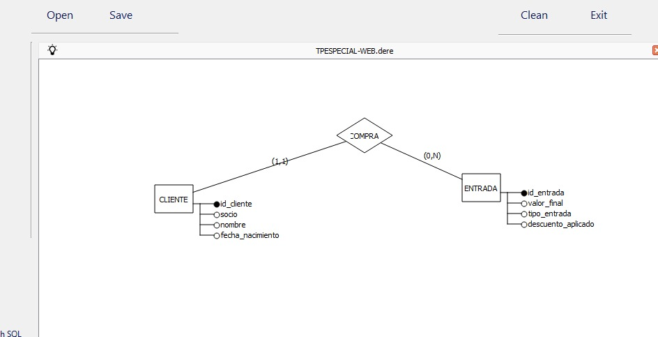

# TPE_WEB2
primera entrega entrega: 28/09/2026

# TPE Parte 1 - Web 2 - Modelo de Datos

**Materia:** Web 2 - Sede Lobería
**Cursada:** 2026
**Entrega:** 28/09/2026

### Integrantes
- Thiago Leonel Martinez - teaxmartinez2025@gmail.com
- Evelyn Rojas Alem - Evelynalemr@gmail.com

### Temática Elegida: Cine

### Introducción y Descripción

El presente trabajo corresponde a la primera entrega del Trabajo Práctico Especial de Web 2, cuya consigna es diseñar exclusivamente el modelo de datos para un sitio web dinámico.

Para este TPE se eligió como universo el de un cine. El sistema tiene como objetivo principal gestionar la venta de entradas y su relación con los clientes. Se busca registrar a los clientes del cine, identificar si son socios para aplicar beneficios, y llevar un control de las entradas adquiridas por cada uno.

Para mantener el modelo simple y normalizado en esta primera etapa, se definieron únicamente dos entidades principales:

**1. CLIENTE:** Almacena la información personal del comprador.
- `id_cliente` (PK, INT, AUTO_INCREMENT)
- `socio` (BOOL)
- `nombre` (VARCHAR 50)
- `fecha_nacimiento` (DATE)

**2. ENTRADA:** Representa cada ticket de cine vendido.
- `id_entrada` (PK, INT, AUTO_INCREMENT)
- `valor_final` (INT)
- `tipo_entrada` (VARCHAR 50) - Ej: 2D, 3D, IMAX
- `descuento_aplicado` (INT)
- `CLIENTE_id_cliente` (FK) - Clave foránea que vincula con CLIENTE

### Diagrama Entidad-Relación (DER)

La relación entre ambas tablas es de uno a muchos (1:N).

- Un **CLIENTE** puede tener muchas **ENTRADAS** (0,N)
- Una **ENTRADA** pertenece a un único **CLIENTE** (1,1)

Esta relación se implementa a través de la clave foránea `FK_ENTRADA_CLIENTE`.

### Archivos de Entrega

- `DER.jpeg`: Diagrama visual del modelo exportado desde DEREX.xt
- `tp_especialweb.sql`: Script SQL de la base de datos exportado desde phpMyAdmin. Contiene la creación de tablas con sus claves primarias, tipos de datos y relaciones.
